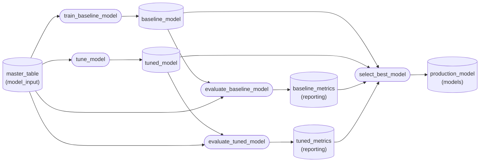

# Pipeline diagrams

Generated by `make diagram` (`scripts/export_pipeline_diagram.py`) and
checked by `test_the_committed_diagram_is_current`, so these cannot drift
from the code. Rounded nodes are functions; cylinders are catalog datasets,
labelled with their `kedro-viz` layer where they declare one.

For the interactive version, with layer bands and dataset previews:

```bash
uv run kedro viz
```

## Data engineering

`data_engineering` — 13 nodes. Raw CSV to master table. Every `fit_*` output is persisted, because inference must apply these, never refit them.

```mermaid
flowchart LR
  n_clean_data([clean_data])
  n_validate_cleaned_modelling_data([validate_cleaned_modelling_data])
  n_split_data([split_data])
  n_fit_imputer([fit_imputer])
  n_apply_imputer([apply_imputer])
  n_fit_outlier_bounds([fit_outlier_bounds])
  n_apply_outlier_bounds([apply_outlier_bounds])
  n_engineer_features([engineer_features])
  n_fit_encoder([fit_encoder])
  n_apply_encoder([apply_encoder])
  n_fit_scaler([fit_scaler])
  n_apply_scaler([apply_scaler])
  n_validate_master_table([validate_master_table])
  d_raw_modelling_data[("raw_modelling_data<br/>(raw)")]
  d_cleaned_modelling_data[("cleaned_modelling_data<br/>(intermediate)")]
  d_validated_modelling_data["validated_modelling_data"]
  d_modelling_data_quality[("modelling_data_quality<br/>(reporting)")]
  d_split_modelling_data[("split_modelling_data<br/>(primary)")]
  d_imputer[("imputer")]
  d_imputed_modelling_data[("imputed_modelling_data<br/>(primary)")]
  d_outlier_bounds[("outlier_bounds")]
  d_primary_modelling_data[("primary_modelling_data<br/>(primary)")]
  d_featured_modelling_data[("featured_modelling_data<br/>(feature)")]
  d_encoder[("encoder")]
  d_encoded_modelling_data[("encoded_modelling_data<br/>(feature)")]
  d_scaler[("scaler")]
  d_scaled_modelling_data["scaled_modelling_data"]
  d_master_table[("master_table<br/>(model_input)")]
  d_master_table_quality[("master_table_quality<br/>(reporting)")]
  d_raw_modelling_data --> n_clean_data
  n_clean_data --> d_cleaned_modelling_data
  d_cleaned_modelling_data --> n_validate_cleaned_modelling_data
  n_validate_cleaned_modelling_data --> d_validated_modelling_data
  n_validate_cleaned_modelling_data --> d_modelling_data_quality
  d_validated_modelling_data --> n_split_data
  n_split_data --> d_split_modelling_data
  d_split_modelling_data --> n_fit_imputer
  n_fit_imputer --> d_imputer
  d_split_modelling_data --> n_apply_imputer
  d_imputer --> n_apply_imputer
  n_apply_imputer --> d_imputed_modelling_data
  d_imputed_modelling_data --> n_fit_outlier_bounds
  n_fit_outlier_bounds --> d_outlier_bounds
  d_imputed_modelling_data --> n_apply_outlier_bounds
  d_outlier_bounds --> n_apply_outlier_bounds
  n_apply_outlier_bounds --> d_primary_modelling_data
  d_primary_modelling_data --> n_engineer_features
  n_engineer_features --> d_featured_modelling_data
  d_featured_modelling_data --> n_fit_encoder
  n_fit_encoder --> d_encoder
  d_featured_modelling_data --> n_apply_encoder
  d_encoder --> n_apply_encoder
  n_apply_encoder --> d_encoded_modelling_data
  d_encoded_modelling_data --> n_fit_scaler
  n_fit_scaler --> d_scaler
  d_encoded_modelling_data --> n_apply_scaler
  d_scaler --> n_apply_scaler
  n_apply_scaler --> d_scaled_modelling_data
  d_scaled_modelling_data --> n_validate_master_table
  n_validate_master_table --> d_master_table
  n_validate_master_table --> d_master_table_quality
```



## Modelling

`modelling` — 5 nodes. Two candidates on the same feature contract; the better held-out `roc_auc` is promoted.



## Inference

`inference` — 9 nodes. Loads the promoted model and the four fitted transformers, and applies the identical transform chain.

```mermaid
flowchart LR
  n_to_dataframe([to_dataframe])
  n_clean_inference_data([clean_inference_data])
  n_validate_cleaned_inference_data([validate_cleaned_inference_data])
  n_impute_inference_data([impute_inference_data])
  n_cap_inference_data([cap_inference_data])
  n_engineer_inference_features([engineer_inference_features])
  n_encode_inference_data([encode_inference_data])
  n_scale_inference_data([scale_inference_data])
  n_predict([predict])
  d_raw_inference_data[("raw_inference_data<br/>(raw)")]
  d_raw_inference_dataframe["raw_inference_dataframe"]
  d_cleaned_inference_data[("cleaned_inference_data<br/>(intermediate)")]
  d_validated_inference_data["validated_inference_data"]
  d_inference_data_quality[("inference_data_quality<br/>(reporting)")]
  d_imputer[("imputer")]
  d_imputed_inference_data["imputed_inference_data"]
  d_outlier_bounds[("outlier_bounds")]
  d_primary_inference_data[("primary_inference_data<br/>(primary)")]
  d_featured_inference_data["featured_inference_data"]
  d_encoder[("encoder")]
  d_encoded_inference_data[("encoded_inference_data<br/>(feature)")]
  d_scaler[("scaler")]
  d_scaled_inference_data[("scaled_inference_data<br/>(model_input)")]
  d_production_model[("production_model<br/>(models)")]
  d_inference_predictions[("inference_predictions<br/>(model_output)")]
  d_raw_inference_data --> n_to_dataframe
  n_to_dataframe --> d_raw_inference_dataframe
  d_raw_inference_dataframe --> n_clean_inference_data
  n_clean_inference_data --> d_cleaned_inference_data
  d_cleaned_inference_data --> n_validate_cleaned_inference_data
  n_validate_cleaned_inference_data --> d_validated_inference_data
  n_validate_cleaned_inference_data --> d_inference_data_quality
  d_validated_inference_data --> n_impute_inference_data
  d_imputer --> n_impute_inference_data
  n_impute_inference_data --> d_imputed_inference_data
  d_imputed_inference_data --> n_cap_inference_data
  d_outlier_bounds --> n_cap_inference_data
  n_cap_inference_data --> d_primary_inference_data
  d_primary_inference_data --> n_engineer_inference_features
  n_engineer_inference_features --> d_featured_inference_data
  d_featured_inference_data --> n_encode_inference_data
  d_encoder --> n_encode_inference_data
  n_encode_inference_data --> d_encoded_inference_data
  d_encoded_inference_data --> n_scale_inference_data
  d_scaler --> n_scale_inference_data
  n_scale_inference_data --> d_scaled_inference_data
  d_production_model --> n_predict
  d_scaled_inference_data --> n_predict
  n_predict --> d_inference_predictions
```


